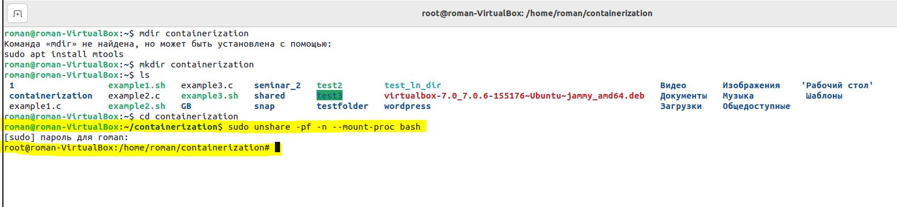
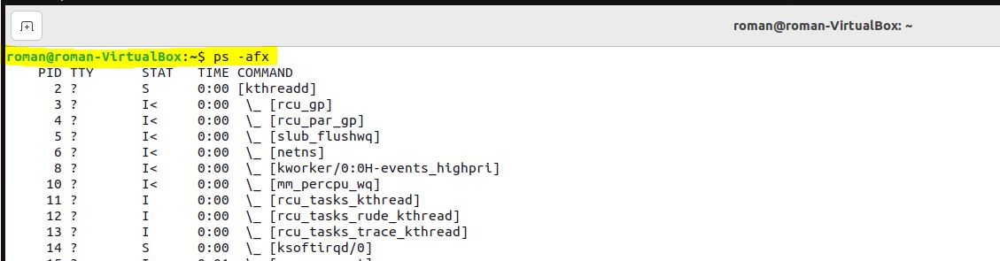
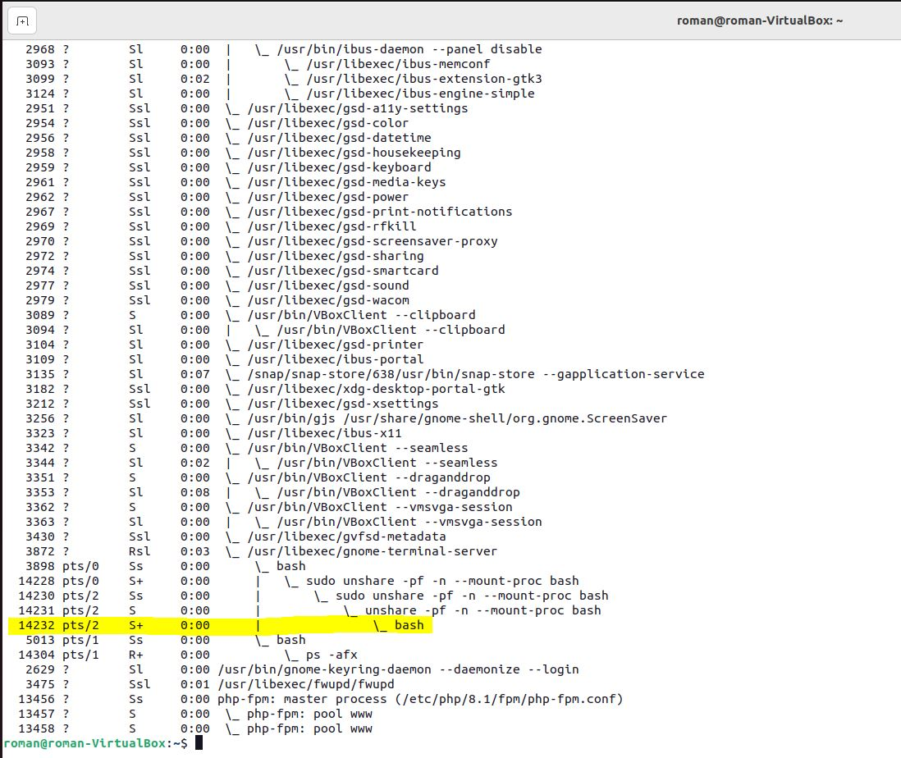
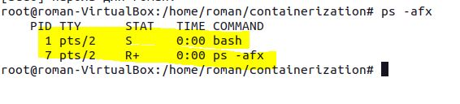
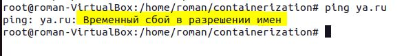
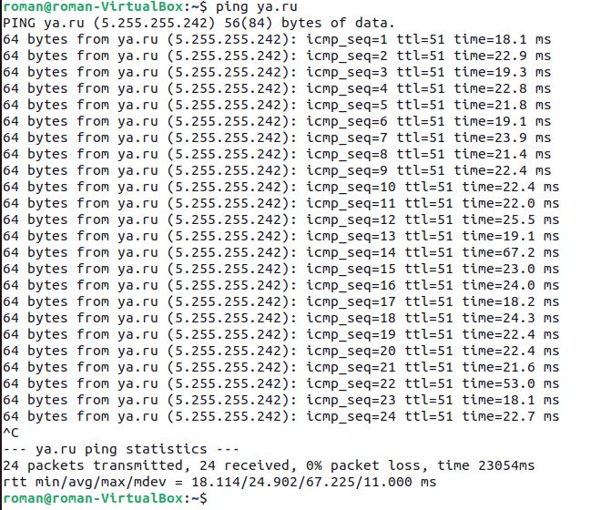
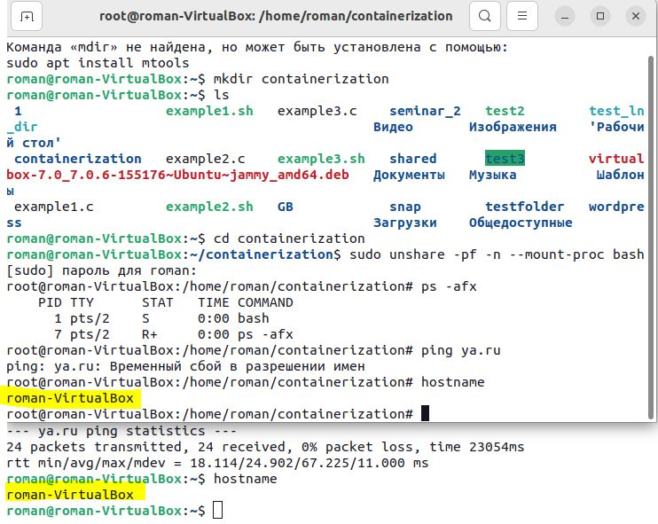
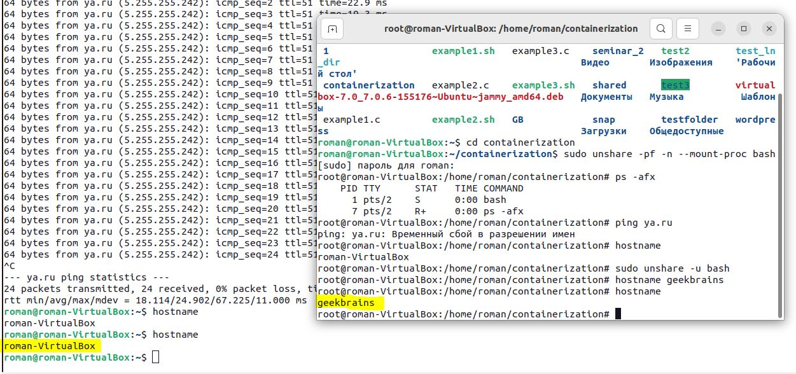

# Урок 1. Механизмы пространства имен
## Classwork
### Познакомились с механизмом пространства имен
## Homework
### Задание: 
Необходимо продемонстрировать изоляцию одного и того же приложения
(как решено на семинаре - командного интерпретатора) в различных пространствах имен.
### Формат сдачи ДЗ: 
Скриншоты с пояснениями 
### Решение:
* Запустим Bash в новом пространстве имен командой (так как команда требует привилегии суперпользователя, то выполняем через sudo):
```
sudo unshare -pf -n --mount-proc bash
```



* В параллельном терминале смотрим, что произошло (наглядно):
```
ps -afx
```


Наблюдаем несколько родительских процессов, которые породили одинаковые процессы Bash. Заметим, что PID у нового процесса 14232.


Для проверки и наглядности смотрим той же командой ps -afx в изолированном терминале.



Здесь мы можем видеть, что изолированная оболочка видит всего два процесса (и то, второй процесс сразу же, после выполнения команды, исчезнет). 
При этом PID процессов начинается с 1.

* Далее, из этого же терминала, пробуем запустить пинг любого сайта, например ya.ru.
```
ping ya.ru
```



Наблюдаем, что пинг до указанного сайта не может быть осуществлен, так как сеть в этом пространстве имен имеется только локальная, т.е. localhost.


А теперь, ту же команду запустим из параллельного терминала (который не изолирован).



Видим, что пакеты до сайта уходят нормально и ответ от сервера принимается.

* Теперь, в оба терминала отправляем команду $ hostname, что бы увидеть наш хост.
```
hostname
```



Как мы можем заметить - хоcт и там и там одинаков. А теперь, в изолированном терминале выполняем команду:
```
sudo unshare -u bash
```
Команда $ unshare запускает программу (опционально) в новом namespace. Флаг -u говорит ей запустить bash в новом UTS namespace. 
Обратите внимание, что наш новый процесс bash указывает на другой файл UTS, тогда как все остальные остаются прежними. 

Одним из следствий проделанной работы является то, что теперь мы можем изменить системный hostname из нашего нового процесса bash, 
и это не повлияет ни на какой другой процесс в системе. 
Изменим наш хост в изолированном терминале, например:
```
hostname geekbrains
```
Эта команда никак не затронула хост основной системы. Можем проверить это, выполнив hostname в неизолированном терминале 
и увидев, что имя хоста там не изменилось.




Этими манипуляциями мы доказали, что научились запускать процессы в разных namespace с возможностью опционально 
изолировать нужные нам направления.


*Подготовил студент GeekBrains* [**`Костиков Роман`**](https://gb.ru/users/d0da3e74-94c9-4467-a23e-2ee70d85dcdc), Seminar_1_containerization